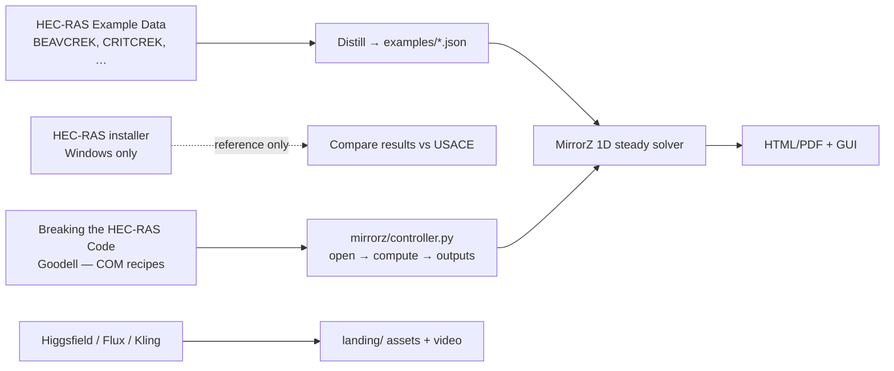

# Forward plan — combining MirrorZ, Breaking the HEC-RAS Code, and USACE materials

## Status (v0.5)

| Phase | Status |
|---|---|
| **0 — Land engine** | Done on branch / PR #2 (merge to `main` still recommended) |
| **1 — Sync private materials** | Blocked on Mac: `./scripts/sync_local_reference.sh` |
| **2 — Distill examples** | **Done (teaching distills):** `critical_creek.json`, `beaver_creek.json` + docs/tests — swap real USACE XS when synced |
| **3 — Controller gaps** | **Done:** `set_boundary`, `raise_bed`, `widen_channel`, CSV/JSON export, `monte_carlo_manning` |
| **4 — Cursor Environment** | Recipe ready: `scripts/install_dev.sh` + `AGENTS.md` — save snapshot in Cursor dashboard |
| **5 — Windows COM bridge** | Optional / later |
| **Assets / alternatives** | **Done v0.5:** competitive landscape, Higgsfield prompt pack, new river hero |

## What each piece is for



## Phase notes

### Phase 1 — Sync private materials (you, on the Mac)
```bash
./scripts/sync_local_reference.sh
```
Paste `find docs/reference -maxdepth 3 -type d` so we can replace teaching
distills with bit-closer USACE geometries.

### Phase 2 — Examples (current)
- `examples/critical_creek.json` — Applications Guide Ch.1 pattern
- `examples/beaver_creek.json` — BEAVCREK automation pattern
- Docs: `docs/examples/*.md` · Tests: `tests/test_controller_v05.py`

### Phase 3 — Controller (shipped in 0.5.0)
See `docs/automation.md` § Phase 3.

### Phase 4 — Persist Environment
```bash
bash scripts/install_dev.sh
pytest -q
```
Then save as a Cursor Environment linked to this repo.

### Assets & alternatives
- Landscape: [`docs/competitive_landscape.md`](competitive_landscape.md) (HEC-RAS 2025, CivilGEO, Higgsfield, …)
- Prompt pack: [`docs/assets/higgsfield_prompts.md`](assets/higgsfield_prompts.md)
- Landing hero: `landing/assets/hero-river.png`

## What not to do

- Do not commit the Goodell PDF or HEC-RAS installers.
- Do not claim teaching distills are bit-exact USACE models.
- Do not market MirrorZ as regulatory floodplain software.
