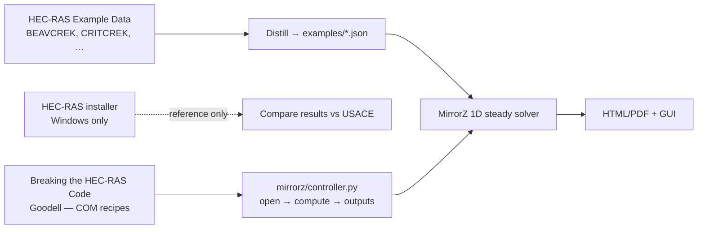

# Forward plan — combining MirrorZ, Breaking the HEC-RAS Code, and USACE materials

## Situation (as of this branch)

| Source | Status in this cloud environment |
|---|---|
| GitHub `main` | Nearly empty (`README.md` only) |
| Branch `claude/hec-ras-modeling-tool-KNK6Y` | Full MirrorZ-Hecras v0.4 engine (this PR starts from it) |
| Sibling cloud agent *Development environment setup* | Running — verified venv, 35 tests, GUI on VNC; no saved Cursor Environment snapshot yet |
| Local folder `/Users/ansom/Downloads/HECRAS-Breaking Hecras Code` | **Not mounted** on cloud agents — must sync from the Mac |

## What each piece is for



1. **Textbook (Goodell)** — teaches *automation shape*: Project_Open → Compute_CurrentPlan → Output_NodeOutput, then sweeps / Monte Carlo. MirrorZ already implements that shape in-process (`docs/automation.md`). Keep the PDF under `docs/reference/breaking-hecras-code/` (gitignored).
2. **HEC-RAS installer** — needed only on a Windows box if you want true COM parity tests. Do not ship installers in GitHub. Cloud Linux agents will never run HECRASController.
3. **Example projects** — gold-standard geometries / flows (Beaver Creek, Critical Creek, Applications Guide Ch.1, …). Use them as **calibration fixtures**: convert select reaches into MirrorZ JSON under `examples/`, then compare WSE/velocity tables.

## Recommended path forward (ordered)

### Phase 0 — Land the engine on `main` (this PR)
- Merge MirrorZ code + agent docs + reference staging.
- Keep `main` as the single source of truth so both cloud agents share one tree.

### Phase 1 — Sync private materials (you, on the Mac)
```bash
./scripts/sync_local_reference.sh
# Review docs/reference/{breaking-hecras-code,hec-ras-examples,hec-ras-install,other}
```
Then paste a directory listing into either cloud agent chat so we can prioritize which examples to distill.

### Phase 2 — Distill 2–3 USACE examples → MirrorZ JSON
Priority targets (classic in Goodell / RAS Solution posts):
1. **Critical Creek** (Applications Guide Ch.1) — smallest steady 1D case
2. **Beaver Creek** (`BEAVCREK`) — book’s default automation demo path
3. One natural multi-n-region section set (LOB / channel / ROB)

For each: hand-translate XS station-elevation + Q + BCs into `examples/*.json`, document assumptions in `docs/examples/<name>.md`, add a regression test that locks MirrorZ WSE within a stated tolerance of published/USACE output (where available).

### Phase 3 — Close controller gaps called out in `docs/automation.md`
- `Controller.set_boundary(...)` for BC sweeps
- Geometry mutation helpers (`raise_bed`, `widen_channel`) — book-style what-ifs
- CSV/JSON result export on the controller
- Optional: Monte Carlo Manning’s n study recipe (blog companion to the book)

### Phase 4 — Persist a Cursor Environment
Sibling agent already proved the recipe; snapshot it so future agents boot warm:
```bash
sudo apt-get install -y python3-venv python3-tk
python3 -m venv .venv && . .venv/bin/activate
pip install -r requirements.txt pytest reportlab
```
Save as a Cursor Environment linked to this repo (dashboard), then both agents inherit it. See `AGENTS.md`.

### Phase 5 — Windows COM bridge (optional, later)
Only if you need bit-for-bit parity with HECRASController on a Windows worker:
- Thin adapter that speaks the same Python API as `Controller` but shells to COM
- Keep MirrorZ as the default cross-platform path; COM as a comparison backend
- Requires self-hosted / Windows private worker — not these Linux cloud pods

## What not to do

- Do not commit the Goodell PDF or companion Excel to a public repo.
- Do not commit HEC-RAS `.exe` / `.msi` installers.
- Do not treat MirrorZ as regulatory floodplain software (see README disclaimer).
- Do not wait on COM to unblock learning — the Python controller already covers the book’s core recipes.

## Immediate asks for you

1. Merge this PR so `main` has the engine.
2. On your Mac, run `./scripts/sync_local_reference.sh` and reply with `find docs/reference -maxdepth 3 -type d` (or attach the Downloads folder tree).
3. Tell us which example to distill first: Critical Creek vs Beaver Creek vs “whatever is already in the Downloads folder.”
4. Optionally finish the sibling setup agent’s Environment snapshot so the next cloud run boots with `.venv` + Tk ready.
